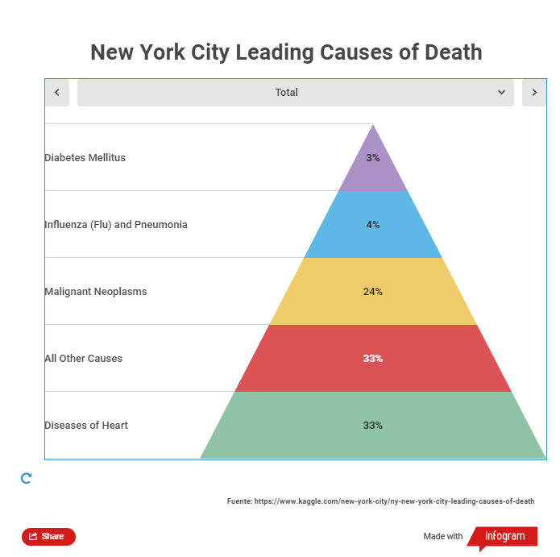

# Estudio de Técnicas de Visualizacion de Datos (PEC2)

#### Autor:  Jonathan Zambrano
#### Máster Universitario en Ciencia de Datos
#### Universidad Oberta de Catalunya

En el presente proyecto se presentan tres pequeñas muestras de técnicas de visualización de datos correspondiente a los siguientes tipos:
 - Pyramid Chart
 - Slope Chart
 - OHLC (open-high-low-close) Chart

### Pyramid Chart

Esta visualización ha sido generada en la web gratuita INFOGRAM, en donde se presentan dos tipos de Pyramid Chart, por un lado se presenta una piramide con información cuanlitativa y por el otro una visualización cuantitativo correspondiente a un Population Pyramid (comparativo de Población y Sexo entre China y Estados Unidos).


Fuente de Datos: Repositorio Kaggle. NY New York City Leading Causes of Death - City of New York.

URL: [Kaggle - NYC Cause of Death 2007 - 2014](https://www.kaggle.com/new-york-city/ny-new-york-city-leading-causes-of-death)


Fuente de Datos: Repositorio Kaggle. Population Pyramid 2019 - Population pyramid (by age group and gender) for some countries - Divyanshu Sharma.

URL: [Kaggle - Population Pyramid 2019](https://www.kaggle.com/hotessy/population-pyramid-2019)

La visualización de los Pyramid Charts se encuentran disponibles en el siguiente link: [Infogram Pyramid Charts](https://infogram.com/pyramid-charts-1hxr4zx9dzl8o6y?live)




### Slope Chart

Para el caso de esta visualización se ha realizado la programación en lenguaje Python tomando en cuenta la información del PIB del repositorio de datos de las Naciones Unidas, en donde, se han seleccionado algunos países de Centro América y Sudamérica para obtener una comparación de la evolución del PIB entre los años 2018 y 2019. 

Fuente de Datos: Repositorio UNData. Per capita GDP at current prices - US dollars. United Nations

URL: [UN - PIB por País](http://data.un.org/Data.aspx?q=GDP&d=SNAAMA&f=grID%3A101%3BcurrID%3AUSD%3BpcFlag%3A1)

``` Python
import pandas as pd
import matplotlib.pyplot as plt

# Fuente de datos
df = pd.read_csv('UNdata.csv')

# Listado de países
countries = ['Argentina', 'Brazil', 'Chile', 'Ecuador', 'Mexico', 'Peru', 'Uruguay']

# Visualización
fig, ax = plt.subplots(1, figsize=(10,10))
for i in countries:
    # get a single country from the list
    temp = df[df['Country or Area'] == i]
    # plot the lines
    plt.plot(temp.Year, temp.Value, marker='o', markersize=5)
    # end label
    plt.text(temp.Year.values[0]+0.02, temp.Value.values[0], i)
    # start label
    plt.text(temp.Year.values[1]-0.02, temp.Value.values[1], i, ha='right')
    
# x limits, x ticks, and y label 
plt.xlim(2017.5,2019.5)
plt.xticks([2018, 2019])
plt.ylabel('USD')
# titulo
plt.title('PIB per capita Latinoamerica', loc='left', fontsize=20)
plt.show()
# Fuente
# https://towardsdatascience.com/slope-charts-with-pythons-matplotlib-2c3456c137b8
```


### OHLC Chart


Fuente de Datos: Repositorio Kaggle. OHLC Financial Data. Denis.

URL: [Kaggle - OHLC Financial Data](https://www.kaggle.com/dozmaden/ohlc-financial-data)

```
import pandas as pd
import matplotlib.pyplot as plt
import numpy as np

df_sp = pd.read_csv('NFLX-D.csv')
#df_sp = pd.read_csv('AMZN-D.csv')

df_sp['timestamp'] = pd.to_datetime(df_sp['timestamp']) 

df = df_sp.sample(n=20, random_state=1).sort_index()
df.reset_index(inplace=True)

x = np.arange(0,len(df))
fig, ax = plt.subplots(1, figsize=(12,6))
for idx, val in df.iterrows():
    # high/low lines
    plt.plot([x[idx], x[idx]], [val['low'], val['high']])
    plt.plot([x[idx], x[idx]-0.1], 
             [val['open'], val['open']])
    # close marker
    plt.plot([x[idx], x[idx]+0.1], 
             [val['close'], val['close']])

# ticks
plt.xticks(x, df.timestamp.dt.date, rotation='vertical')
ax.set_xticks(x, minor=True)
# labels
plt.ylabel('USD')
# grid
ax.xaxis.grid(color='black', linestyle='dashed', which='both', alpha=0.1)
# title
plt.title('Netflix Stock Price', loc='left', fontsize=20)
plt.show()
# Fuente
# https://towardsdatascience.com/basics-of-ohlc-charts-with-pythons-matplotlib-56d0e745a5be
```


